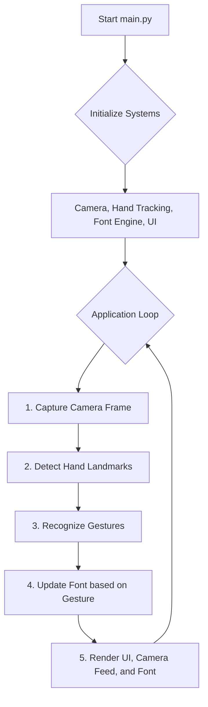
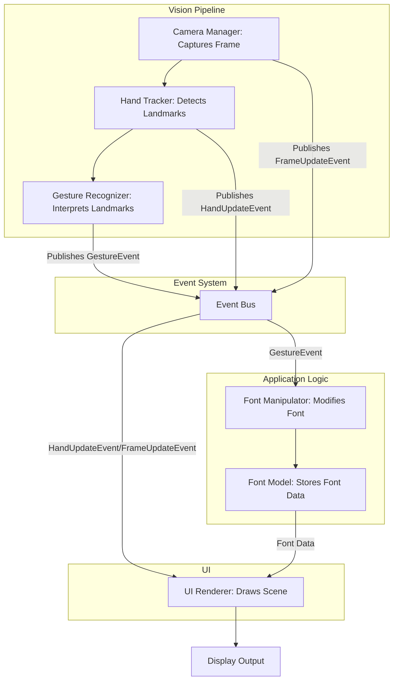

# Gestural Font Editor

[](https://www.python.org/downloads/)
[](https://opensource.org/licenses/MIT)

A real-time, gesture-controlled font editor that uses computer vision to manipulate font properties with your hand movements.


## 📜 Table of Contents
- [Features](#-features)
- [Project Structure](#-project-structure)
- [How It Works](#-how-it-works)
- [Setup and Installation](#-setup-and-installation)
- [Usage](#-usage)
- [Configuration](#-configuration)

## ✨ Features

*   **Real-Time Hand Tracking**: Utilizes Google's MediaPipe for high-fidelity hand and finger tracking.
*   **Gesture-Based Controls**: Intuitively control font properties with hand gestures.
    *   **Mode Switching**: Pinch your index finger and thumb to switch between "Smoothness" and "Distortion" modes.
    *   **Parameter Adjustment**: Move your hand vertically to increase or decrease the selected property's value.
*   **Live Rendering**: See the font character update in real-time on the screen, overlaid on your camera feed.
*   **Modular Architecture**: Built with a decoupled event-driven architecture, making it easy to extend and maintain.

## 📂 Project Structure

The project is organized into modules with specific responsibilities:

```
.
├── config.py               # Centralized configuration and settings
├── event_bus.py            # Event handling system for decoupled communication
├── exceptions.py           # Custom exception classes
├── main.py                 # Main application entry point
├── requirements.txt        # Project dependencies
├── font_engine/
│   ├── bezier_curves.py    # Utilities for Bezier curve calculations
│   ├── font_manipulator.py # Applies transformations to the font model
│   └── font_model.py       # Defines the data structure for the font character
├── ui/
│   └── renderer.py         # Handles all rendering to the screen
├── utils/
│   └── geometry.py         # Helper functions for geometric calculations
└── vision/
    ├── camera_manager.py   # Manages the webcam feed
    ├── gesture_recognizer.py # Interprets hand landmarks into gestures
    └── hand_tracker.py     # Detects and tracks hand landmarks
```

## Diagrams

### High-Level Application Flow

This chart shows the main loop of the application.



### Component Interaction Flow

This chart illustrates how the different modules communicate through the event bus.



## 🚀 Setup and Installation

1.  **Clone the repository:**
    ```bash
    git clone <your-repository-link>
    cd Vision
    ```

2.  **Create a virtual environment (recommended):**
    ```bash
    python -m venv venv
    source venv/bin/activate  # On Windows, use `venv\Scripts\activate`
    ```

3.  **Install the dependencies:**
    The `requirements.txt` file contains all the necessary packages.
    ```bash
    pip install -r requirements.txt
    ```

## 🏃 Usage

Run the main application with this command:

```bash
python main.py
```

A window will open showing your webcam feed.

*   **Show your hand** to the camera. The application will draw landmarks on it.
*   **Pinch your index finger and thumb** to cycle through the control modes (`SMOOTH` and `DISTORT`).
*   **Move your hand up or down** to adjust the value of the currently selected mode.
*   **Press the 'r' key** to reset the font to its original shape.
*   **Press the 'q' key** to quit the application.

## ⚙️ Configuration

You can modify the application's behavior by editing the `config.py` file. This file contains settings for the camera, UI, font, and gesture recognition thresholds.
